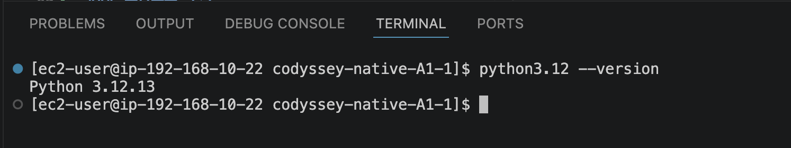
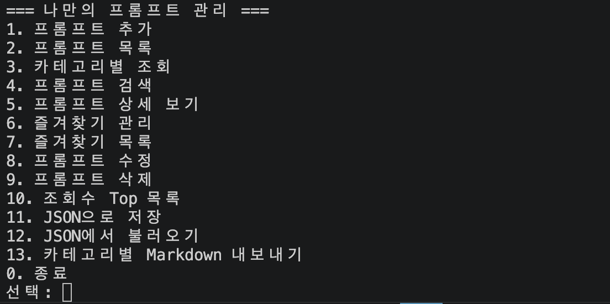
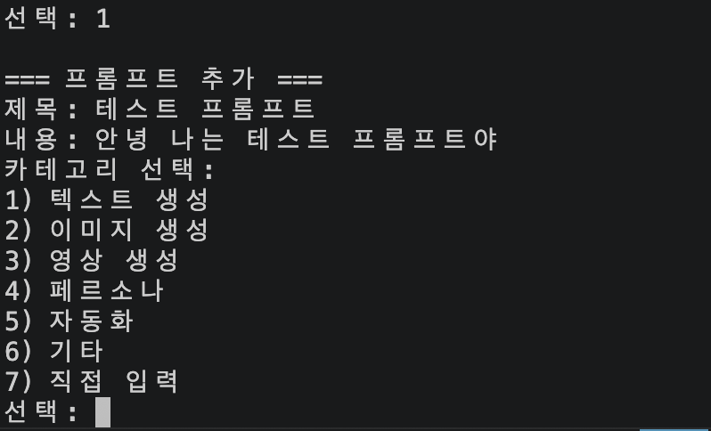
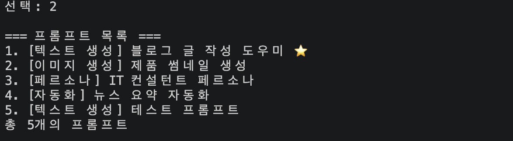
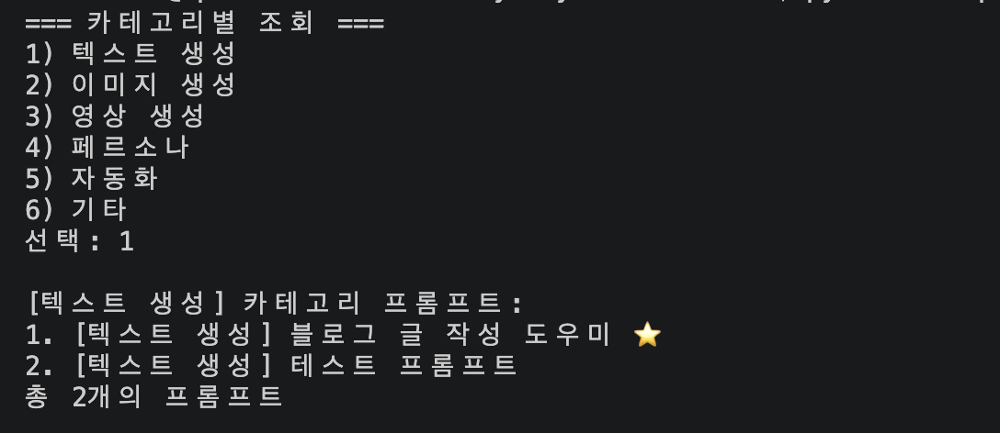
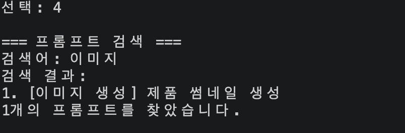
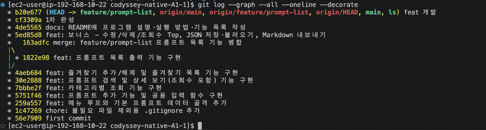

# 나만의 프롬프트 관리 (Prompt Manager)

터미널에서 메뉴 번호를 입력해 AI 프롬프트를 추가·조회·검색·관리하는 **Python 콘솔 프로그램**입니다.
외부 라이브러리 없이 파이썬 표준 문법과 표준 라이브러리(`json`)만 사용합니다.

## 실행 방법

Python 3.10 이상이 필요합니다.

```bash
# 저장소 클론
git clone <저장소 URL>
cd codyssey-native-A1-1

# 파이썬 버전 확인 (3.10 이상)
python --version

# 프로그램 실행
python prompt_manager.py
```

실행하면 메뉴가 출력되고, 번호를 입력해 기능을 선택합니다.
잘못된 번호를 입력하면 안내 메시지를 보여주고 다시 메뉴로 돌아갑니다.
`0`을 선택하면 프로그램이 종료됩니다.

> 실행 중 추가한 프롬프트와 즐겨찾기 상태는 메모리에 유지되며, 종료 시 초기화됩니다.
> (`11. JSON으로 저장` / `12. JSON에서 불러오기`로 영속화할 수 있습니다.)

## 기능 목록

### 기본 기능
| 번호 | 기능 | 설명 |
| --- | --- | --- |
| 1 | 프롬프트 추가 | 제목·내용·카테고리를 입력해 새 프롬프트 등록 (빈 값 재입력) |
| 2 | 프롬프트 목록 | 전체 프롬프트를 번호·카테고리·즐겨찾기(⭐)와 함께 출력 |
| 3 | 카테고리별 조회 | 선택한 카테고리의 프롬프트만 출력 |
| 4 | 프롬프트 검색 | 제목 또는 내용에 키워드가 포함된 프롬프트 검색 |
| 5 | 프롬프트 상세 보기 | 번호 입력 시 전체 내용 출력 (조회수 증가) |
| 6 | 즐겨찾기 관리 | 번호 입력으로 즐겨찾기 추가/해제 |
| 7 | 즐겨찾기 목록 | 즐겨찾기한 프롬프트만 모아서 출력 |
| 0 | 종료 | 프로그램 종료 |

### 보너스 기능
| 번호 | 기능 | 설명 |
| --- | --- | --- |
| 8 | 프롬프트 수정 | 제목·내용·카테고리 수정 (빈 입력 시 기존값 유지) |
| 9 | 프롬프트 삭제 | 번호 입력으로 프롬프트 삭제 |
| 10 | 조회수 Top 목록 | 조회수 기준 내림차순 정렬 출력 |
| 11 | JSON으로 저장 | 현재 데이터를 `prompts.json`으로 저장 |
| 12 | JSON에서 불러오기 | `prompts.json`에서 데이터 불러오기 |
| 13 | Markdown 내보내기 | 카테고리별 `.md` 파일을 `prompts_export/`에 생성 |

## 실행 화면

각 기능이 정상 동작하는 것을 증명하는 스크린샷입니다.

### 개발 환경



### 메인 메뉴



### 프롬프트 추가



### 전체 목록



### 카테고리별 조회



### 검색



### 상세 보기


### 즐겨찾기 추가/해제


### 즐겨찾기 목록


### 잘못된 입력 처리


### Git 이력



## 프롬프트 카테고리

미리 정의된 카테고리는 다음과 같으며, 추가 시 직접 입력도 가능합니다.

- **텍스트 생성** — 글, 이메일, 요약 등 텍스트 작성용 프롬프트
- **이미지 생성** — 썸네일, 일러스트 등 이미지 생성용 프롬프트
- **영상 생성** — 광고 스크립트, 영상 기획 등
- **페르소나** — 특정 전문가 역할을 부여하는 프롬프트
- **자동화** — 요약·분류 등 반복 작업 자동화 프롬프트
- **기타** — 위 분류에 속하지 않는 프롬프트

기본 데이터로 `블로그 글 작성 도우미`, `제품 썸네일 생성`, `IT 컨설턴트 페르소나`, `뉴스 요약 자동화` 4개가 등록되어 있습니다.

## 데이터 구조

프롬프트는 리스트 안의 딕셔너리로 저장합니다.

```python
prompts = [
    {
        "title": "블로그 글 작성 도우미",
        "content": "당신은 10년 경력의 전문 블로거입니다...",
        "category": "텍스트 생성",
        "favorite": True,
        "views": 0,
    },
]
```

## 코드 구조

기능별로 함수를 분리했습니다.

### 공용 함수

```python
def input_nonempty(label):
    """빈 값이 들어오면 다시 입력을 요청하는 공용 입력 함수."""
    while True:
        value = input(label).strip()
        if value:
            return value
        print("빈 값은 입력할 수 없습니다. 다시 입력해주세요.")


def select_category():
    """카테고리를 목록에서 선택하거나 직접 입력하도록 한다."""
    print("카테고리 선택:")
    for i, name in enumerate(CATEGORIES, start=1):
        print(f"{i}) {name}")
    print(f"{len(CATEGORIES) + 1}) 직접 입력")

    while True:
        choice = input("선택: ").strip()
        if choice.isdigit():
            num = int(choice)
            if 1 <= num <= len(CATEGORIES):
                return CATEGORIES[num - 1]
            if num == len(CATEGORIES) + 1:
                return input_nonempty("카테고리 직접 입력: ")
        print("올바른 번호를 선택해주세요.")


def format_line(index, item):
    """목록 한 줄 표기: '1. [카테고리] 제목 ⭐'"""
    star = " ⭐" if item["favorite"] else ""
    return f"{index}. [{item['category']}] {item['title']}{star}"
```

### 1. 프롬프트 추가

```python
def add_prompt():
    """새 프롬프트를 입력받아 리스트에 추가한다."""
    print("\n=== 프롬프트 추가 ===")
    title = input_nonempty("제목: ")
    content = input_nonempty("내용: ")
    category = select_category()

    prompts.append({
        "title": title,
        "content": content,
        "category": category,
        "favorite": False,
        "views": 0,
    })
    print("프롬프트가 추가되었습니다!")
```

### 2. 프롬프트 목록

```python
def show_list():
    """저장된 모든 프롬프트를 번호와 함께 출력한다."""
    print("\n=== 프롬프트 목록 ===")
    if not prompts:
        print("등록된 프롬프트가 없습니다.")
        return

    for i, item in enumerate(prompts, start=1):
        print(format_line(i, item))
    print(f"총 {len(prompts)}개의 프롬프트")
```

### 3. 카테고리별 조회

```python
def show_by_category():
    """카테고리를 선택하면 해당 카테고리의 프롬프트만 출력한다."""
    print("\n=== 카테고리별 조회 ===")
    for i, name in enumerate(CATEGORIES, start=1):
        print(f"{i}) {name}")

    choice = input("선택: ").strip()
    if not choice.isdigit() or not (1 <= int(choice) <= len(CATEGORIES)):
        print("올바른 번호를 선택해주세요.")
        return

    category = CATEGORIES[int(choice) - 1]
    matched = [p for p in prompts if p["category"] == category]

    if not matched:
        print(f"[{category}] 카테고리에 등록된 프롬프트가 없습니다.")
        return

    print(f"\n[{category}] 카테고리 프롬프트:")
    for i, item in enumerate(matched, start=1):
        print(format_line(i, item))
    print(f"총 {len(matched)}개의 프롬프트")
```

### 4. 프롬프트 검색

```python
def search_prompt():
    """키워드로 제목 또는 내용에 포함된 프롬프트를 검색한다."""
    print("\n=== 프롬프트 검색 ===")
    keyword = input_nonempty("검색어: ").lower()

    matched = [
        p for p in prompts
        if keyword in p["title"].lower() or keyword in p["content"].lower()
    ]

    if not matched:
        print("검색 결과가 없습니다.")
        return

    print("검색 결과:")
    for i, item in enumerate(matched, start=1):
        print(format_line(i, item))
    print(f"{len(matched)}개의 프롬프트를 찾았습니다.")
```

### 5. 프롬프트 상세 보기

```python
def show_detail():
    """번호를 입력하면 해당 프롬프트의 전체 내용을 출력한다. (조회수 증가)"""
    print("\n=== 프롬프트 상세 보기 ===")
    if not prompts:
        print("등록된 프롬프트가 없습니다.")
        return

    choice = input("번호 입력: ").strip()
    if not choice.isdigit() or not (1 <= int(choice) <= len(prompts)):
        print("잘못된 번호입니다.")
        return

    item = prompts[int(choice) - 1]
    item["views"] += 1
    star = "⭐" if item["favorite"] else "없음"

    line = "─" * 28
    print(line)
    print(f"제목: {item['title']}")
    print(f"카테고리: {item['category']}")
    print(f"즐겨찾기: {star}")
    print(f"조회수: {item['views']}")
    print(line)
    print("내용:")
    print(item["content"])
    print(line)
```

### 6. 즐겨찾기 관리

```python
def manage_favorite():
    """번호를 입력해 즐겨찾기를 추가/해제한다."""
    print("\n=== 즐겨찾기 관리 ===")
    print("즐겨찾기 토글 기능입니다. 중복 즐겨찾기 시 취소됩니다.")
    if not prompts:
        print("등록된 프롬프트가 없습니다.")
        return

    for i, item in enumerate(prompts, start=1):
        print(format_line(i, item))

    choice = input("프롬프트 번호 입력: ").strip()
    if not choice.isdigit() or not (1 <= int(choice) <= len(prompts)):
        print("잘못된 번호입니다.")
        return

    item = prompts[int(choice) - 1]
    item["favorite"] = not item["favorite"]  # 토글
    if item["favorite"]:
        print(f"'{item['title']}' 프롬프트를 즐겨찾기에 추가했습니다!")
    else:
        print(f"'{item['title']}' 프롬프트를 즐겨찾기에서 해제했습니다.")
```

### 7. 즐겨찾기 목록

```python
def show_favorites():
    """즐겨찾기된 프롬프트만 모아서 출력한다."""
    print("\n=== 즐겨찾기 목록 ===")
    matched = [p for p in prompts if p["favorite"]]

    if not matched:
        print("즐겨찾기한 프롬프트가 없습니다.")
        return

    for i, item in enumerate(matched, start=1):
        print(format_line(i, item))
    print(f"총 {len(matched)}개의 즐겨찾기")
```

### 8. 프롬프트 수정

```python
def edit_prompt():
    """번호를 입력해 프롬프트의 제목/내용/카테고리를 수정한다. (빈 입력은 기존값 유지)"""
    print("\n=== 프롬프트 수정 ===")
    if not prompts:
        print("등록된 프롬프트가 없습니다.")
        return

    for i, item in enumerate(prompts, start=1):
        print(format_line(i, item))

    choice = input("수정할 번호 입력: ").strip()
    if not choice.isdigit() or not (1 <= int(choice) <= len(prompts)):
        print("잘못된 번호입니다.")
        return

    item = prompts[int(choice) - 1]
    print("(빈 값으로 두면 기존 내용을 유지합니다.)")
    new_title = input(f"제목 [{item['title']}]: ").strip()
    new_content = input("내용 (기존 유지하려면 Enter): ").strip()

    # 값이 있을 때만 교체
    if new_title:
        item["title"] = new_title
    if new_content:
        item["content"] = new_content

    change = input("카테고리를 변경할까요? (y/N): ").strip().lower()
    if change == "y":
        item["category"] = select_category()

    print("프롬프트가 수정되었습니다!")
```

### 9. 프롬프트 삭제

```python
def delete_prompt():
    """번호를 입력해 프롬프트를 삭제한다."""
    print("\n=== 프롬프트 삭제 ===")
    if not prompts:
        print("등록된 프롬프트가 없습니다.")
        return

    for i, item in enumerate(prompts, start=1):
        print(format_line(i, item))

    choice = input("삭제할 번호 입력: ").strip()
    if not choice.isdigit() or not (1 <= int(choice) <= len(prompts)):
        print("잘못된 번호입니다.")
        return

    removed = prompts.pop(int(choice) - 1)
    print(f"'{removed['title']}' 프롬프트를 삭제했습니다.")
```

### 10. 조회수 Top 목록

```python
def show_top_views():
    """조회수 기준으로 정렬한 Top 목록을 출력한다."""
    print("\n=== 조회수 Top 목록 ===")
    if not prompts:
        print("등록된 프롬프트가 없습니다.")
        return

    ranked = sorted(prompts, key=lambda p: p["views"], reverse=True)
    for i, item in enumerate(ranked, start=1):
        print(f"{format_line(i, item)}  (조회수 {item['views']})")
```

### 11. JSON으로 저장 / 12. JSON에서 불러오기

```python
def save_to_json():
    """현재 프롬프트 데이터를 JSON 파일로 저장한다. (보너스)"""
    print("\n=== JSON으로 저장 ===")
    with open(DATA_FILE, "w", encoding="utf-8") as f:
        json.dump(prompts, f, ensure_ascii=False, indent=2)
    print(f"'{DATA_FILE}' 파일에 {len(prompts)}개의 프롬프트를 저장했습니다.")


def load_from_json():
    """JSON 파일에서 프롬프트 데이터를 불러온다. (보너스)"""
    print("\n=== JSON에서 불러오기 ===")
    if not os.path.exists(DATA_FILE):
        print(f"'{DATA_FILE}' 파일이 없습니다. 먼저 저장해주세요.")
        return

    with open(DATA_FILE, "r", encoding="utf-8") as f:
        loaded = json.load(f)

    prompts.clear()
    for item in loaded:
        item.setdefault("favorite", False)
        item.setdefault("views", 0)
        prompts.append(item)
    print(f"{len(prompts)}개의 프롬프트를 불러왔습니다.")
```

### 13. 카테고리별 Markdown 내보내기

```python
def export_markdown():
    """전체 프롬프트를 카테고리별 Markdown 파일로 내보낸다. (보너스)"""
    print("\n=== 카테고리별 Markdown 내보내기 ===")
    if not prompts:
        print("내보낼 프롬프트가 없습니다.")
        return

    export_dir = "prompts_export"
    os.makedirs(export_dir, exist_ok=True)

    categories = sorted({p["category"] for p in prompts})
    for category in categories:
        items = [p for p in prompts if p["category"] == category]
        # 파일 이름 공백, 슬래시 제거
        safe_name = category.replace(" ", "_").replace("/", "_")
        path = os.path.join(export_dir, f"{safe_name}.md")
        with open(path, "w", encoding="utf-8") as f:
            f.write(f"# {category}\n\n")
            for item in items:
                star = " ⭐" if item["favorite"] else ""
                f.write(f"## {item['title']}{star}\n\n")
                f.write(f"{item['content']}\n\n")

    print(f"'{export_dir}/' 폴더에 {len(categories)}개 카테고리의 Markdown 파일을 생성했습니다.")
```

### 메뉴 반복 (main)

```python
def main():
    """프로그램 진입점. 메뉴를 반복해서 보여주고 입력을 처리한다."""
    while True:
        show_menu()
        choice = input("선택: ").strip()

        if choice == "1":
            add_prompt()
        elif choice == "2":
            show_list()
        # ... (번호별 elif 분기, "0"이면 break로 종료)
        else:
            print("잘못된 번호입니다. 메뉴에서 다시 선택해주세요.")
```

## Git 사용 이력

기본 골격은 `main` 브랜치에서 기능 단위로 순차 커밋했고, "프롬프트 목록 출력" 기능은
`feature/prompt-list` 브랜치를 별도로 만들어 개발한 뒤 `main`에 병합하는 방식으로 작업했습니다.

1. `main`에서 초기 설정(`.gitignore`) → 메뉴/데이터 골격 → 추가 → 카테고리별 조회 → 검색/상세 보기 → 즐겨찾기까지 순서대로 커밋
2. `git checkout -b feature/prompt-list`로 브랜치를 분리해 "프롬프트 목록 출력" 기능 개발
3. `git checkout main` 후 `git merge feature/prompt-list`로 병합 (병합 커밋 `163adfc`, 부모 커밋 2개)
4. 이후 보너스 기능(수정/삭제/조회수 Top/JSON 저장·불러오기/Markdown 내보내기)과 문서화를 `main`에서 계속 진행
5. `feature/prompt-list` 브랜치를 다시 만들어 추가 기능을 개발한 뒤 `main`으로 병합 (Fast-forward)

전체 이력은 아래 명령으로 확인할 수 있습니다.

```bash
git log --graph --all --oneline --decorate
```

```
* b20e677 (HEAD -> feature/prompt-list, main) feat 개발
* cf3309a 1차 완성
* 4de5565 docs: README에 프로그램 설명·실행 방법·기능 목록 작성
* 5ed85d8 feat: 보너스 - 수정/삭제/조회수 Top, JSON 저장·불러오기, Markdown 내보내기
*   163adfc merge: feature/prompt-list 프롬프트 목록 기능 병합
|\
| * 1822e98 feat: 프롬프트 목록 출력 기능 구현
|/
* 4aeb684 feat: 즐겨찾기 추가/해제 및 즐겨찾기 목록 기능 구현
* 30e2888 feat: 프롬프트 검색 및 상세 보기(조회수 포함) 기능 구현
* 7bbbe2f feat: 카테고리별 조회 기능 구현
* 5751f46 feat: 프롬프트 추가 기능 및 공용 입력 함수 구현
* 259a557 feat: 메뉴 루프와 기본 프롬프트 데이터 골격 추가
* 1c47269 chore: 불필요 파일 제외용 .gitignore 추가
* 56e7909 first commit
```
